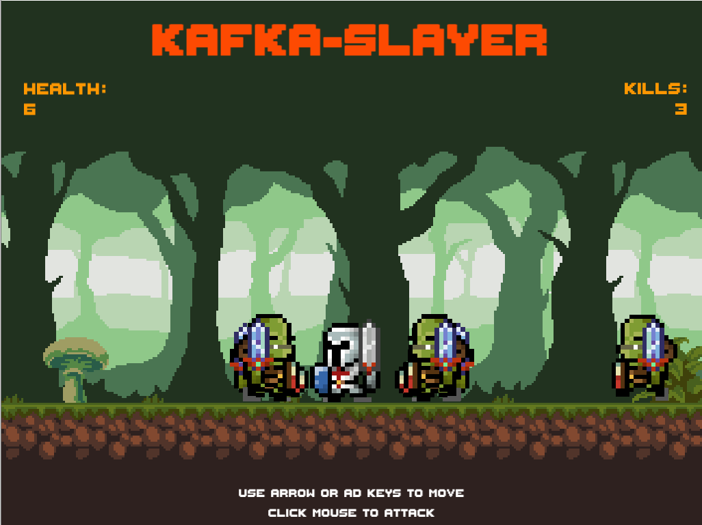

This project demonstrates a simple data pipeline from the app level to the database.
The API server is served using Flask, and each incoming events are queued in kafka and read by 4 dedicated spark sessions to write to HDFS.
The user can then use presto to query against the database for further analysis such as balancing the game and improve the user experience.

Playable web version can be found at [http://sirak.ca/kafka-slayer/](http://sirak.ca/kafka-slayer/).

## Getting Started

clone the repo below:
```
mkdir w205
cd w205
git clone https://github.com/jjm011/w205-final-project.git
cd w205-final-project
```


make sure you have docker installed on your 
Ubuntu machine:
```
sudo apt-get update -y
sudo apt-get install docker-engine -y
```

CentOS:
```
sudo yum update -y
sudo yum install docker-engine -y
```

### Assemble the data pipeline
First you need to launch the docker containers using the provided docker-compose file:
```
docker-compose up -d
```

Wait for all the containers to be started, then run the script in ```bin```

```
bash bin/create_kafka_topic.sh 
bash bin/create_hive_table.sh
bash bin/start_spark_session.sh
```

Start the flask API

```
docker-compose exec mids env FLASK_APP=/w205/w205-final-project/game_api.py flask run --host 0.0.0.0
```


## Running the tests
There is prebuilt test API calls under the ```test``` directory

```
/bin/bash test/test_data.sh
```

Feel free to change the test data in ```test``` and the number of API calls to make.
Currently, it is making only one request per API

## Authors

* **Jacky Ma** 
* **Sirak Ghebremusse**

See also the list of [contributors](https://github.com/jjm011/w205-final-project/contributors) who participated in this project.
